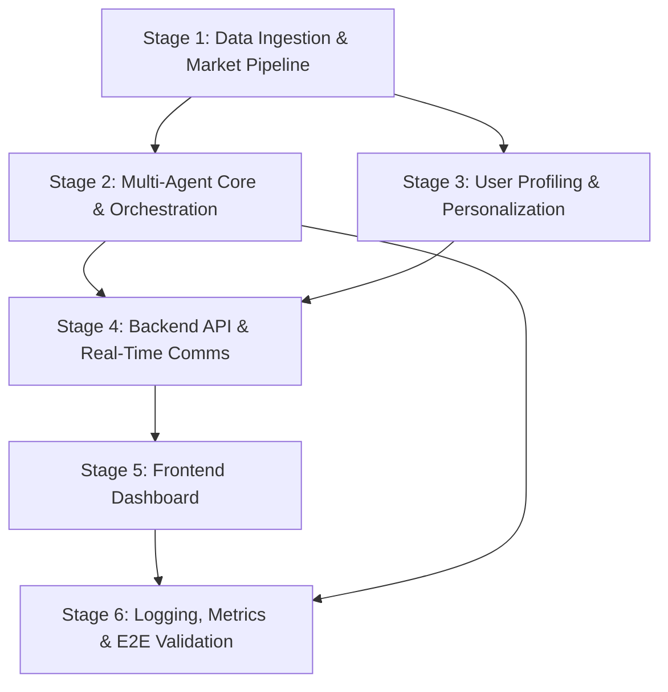

# Multi-Agent Autonomous Financial Intelligence System — Architecture Plan

> **Project:** HACKVERSE: INTO THE WEB — Sprint 1  
> **Problem Statement:** PS-01 — Multi-Agent Autonomous Financial Intelligence System for Retail Investors  
> **Goal:** Convert real-time market data, regulatory filings, and behavioral signals into explainable, personalized investment intelligence via a coordinated multi-agent AI system.

---

## High-Level System Diagram

```
┌─────────────────────────────────────────────────────────────────────┐
│                        CLIENT / DASHBOARD                          │
│  Live Signals · Agent Reasoning Traces · Portfolio State · Alerts  │
└──────────────────────────────┬──────────────────────────────────────┘
                               │  WebSocket / REST
┌──────────────────────────────▼──────────────────────────────────────┐
│                      API GATEWAY (FastAPI)                          │
│         Auth · Rate-Limit · Session Mgmt · Request Router           │
└──────────┬───────────┬───────────┬───────────┬──────────────────────┘
           │           │           │           │
     ┌─────▼──┐  ┌─────▼──┐  ┌────▼───┐  ┌───▼────────┐
     │ Market │  │  RAG   │  │ User   │  │ Orchestrator│
     │ Data   │  │ Engine │  │ Profile│  │  (Agents)   │
     │ Ingestion│ │        │  │ Service│  │             │
     └─────┬──┘  └────┬───┘  └───┬────┘  └──┬──────────┘
           │          │          │           │
     ┌─────▼──┐  ┌────▼───┐  ┌──▼────┐  ┌──▼──────────────────┐
     │ Market │  │ Vector │  │ User  │  │  Specialized Agents  │
     │ Data   │  │   DB   │  │  DB   │  │ ┌──────┬──────┬────┐ │
     │ Cache  │  │(Chroma)│  │       │  │ │Tech  │Sent. │Fund│ │
     │(Redis) │  │        │  │       │  │ │Agent │Agent │Agt │ │
     └────────┘  └────────┘  └───────┘  │ └──────┴──────┴────┘ │
                                        └──────────┬───────────┘
                                                   │
                                        ┌──────────▼───────────┐
                                        │  Synthesis Agent     │
                                        │  (Merge + Explain)   │
                                        └──────────┬───────────┘
                                                   │
                                        ┌──────────▼───────────┐
                                        │  Logging & Metrics   │
                                        │  (Performance Store)  │
                                        └──────────────────────┘
```

---

## Technology Stack

| Layer              | Technology                                          | Free? | Notes |
| ------------------ | --------------------------------------------------- | :---: | ----- |
| Frontend           | React (Vite) + Lightweight Charts + Vanilla CSS     | ✅    | 100% free, open-source (MIT) |
| Backend API        | FastAPI (Python)                                    | ✅    | Open-source (MIT), self-hosted |
| Multi-Agent Engine | LangGraph                                           | ✅    | Open-source (MIT), `pip install langgraph` |
| LLM Provider       | Groq API — Llama 3.3 70B                            | ✅⚠️  | Free tier: ~30 RPM / no credit card needed. Rate-limit retries required for parallel agents |
| Vector DB          | ChromaDB (embedded mode)                            | ✅    | Open-source (Apache 2.0), runs fully in-process — no server needed for hackathon |
| Embeddings         | `sentence-transformers` — `all-MiniLM-L6-v2`        | ✅    | Runs 100% locally after one-time model download (~80 MB), no API key |
| Cache              | In-process `dict` / `functools.lru_cache`           | ✅⚠️  | **Redis removed** — Redis Cloud free tier was eliminated. For a 24-hr hackathon an in-process TTL cache is sufficient |
| Primary DB         | SQLite                                              | ✅    | Zero-config, file-based, bundled with Python |
| Market Data        | `yfinance` (Yahoo Finance scraper)                  | ✅⚠️  | Free, no key — but unofficial. Throttles after ~2 000 req/hr. Must batch tickers and add delays. Supplement with CSV mock for demo |
| News / Sentiment   | GNews API (free tier) or RSS feeds                  | ✅⚠️  | **NewsAPI replaced** — NewsAPI free tier has 24-hr data delay, unusable for live demo. GNews gives 100 req/day with no delay, or scrape Google Finance RSS |
| Document Parsing   | LangChain + PyMuPDF                                 | ✅    | Open-source; PyMuPDF already installed in this workspace |
| Real-time Comms    | WebSockets — FastAPI native                         | ✅    | Built into Starlette, no extra dependency |

> **All tools in this stack are free for local/hackathon use. No paid tier is required.**

---

## Tech Stack: Key Decisions & Substitutions

### ❌ Redis → ✅ In-Process Cache
Redis Cloud's always-free tier was discontinued. For a 24-hour hackathon with a single-server setup, a simple Python `TTLCache` (from `cachetools`) running in-process is sufficient. If a shared cache is needed between processes, use a local SQLite table as a KV store.

```python
# cache.py — replacement for Redis
from cachetools import TTLCache
market_cache = TTLCache(maxsize=500, ttl=30)  # 30-second TTL on price data
```

### ❌ NewsAPI → ✅ GNews API / RSS
NewsAPI Developer plan has a **24-hour data delay** — this makes it unusable for any live sentiment demo. Replacements:
- **GNews API** — 100 free req/day, real-time, simple JSON, no delay
- **Google Finance RSS** — `https://news.google.com/rss/search?q=RELIANCE+stock` — free, no key, real-time

### ⚠️ Groq Rate Limits with Parallel Agents
Running 3 agents in parallel on the free tier (30 RPM shared) is tight. Mitigations built into the orchestrator:
- Stagger agent dispatch by ~1 s
- Use exponential backoff on 429s
- Cache identical ticker+profile analysis results for the session

### ⚠️ yfinance Fragility
`yfinance` is an unofficial scraper. For the demo:
- Batch all ticker requests into a single `.download()` call
- Pre-fetch and snapshot data at session start; serve from in-memory store
- Keep a set of CSV fixtures in `data/mock/` as a guaranteed fallback

---

## Stage-Wise Development Plan

---

### Stage 1 — Data Ingestion & Market Data Pipeline

**Objective:** Build the foundational data layer that fetches, normalizes, and caches live/simulated market data and ingests regulatory documents into a searchable corpus.

#### Modules

##### 1.1 Market Data Service (`services/market_data/`)

| File                  | Responsibility                                                                  |
| --------------------- | ------------------------------------------------------------------------------- |
| `fetcher.py`          | Pulls real-time / historical OHLCV data via `yfinance`; fallback to CSV mock    |
| `indicators.py`       | Computes technical indicators — RSI, MACD, Bollinger Bands, VWAP, OBV          |
| `cache.py`            | Redis-backed TTL cache for price snapshots (avoids API rate-limits)              |
| `models.py`           | Pydantic schemas: `StockQuote`, `IndicatorSet`, `MarketSnapshot`                |

##### 1.2 Document Ingestion Service (`services/document_ingestion/`)

| File                  | Responsibility                                                                  |
| --------------------- | ------------------------------------------------------------------------------- |
| `loader.py`           | Reads PDFs, earnings transcripts, SEBI filings via LangChain loaders            |
| `chunker.py`          | Splits documents into semantically coherent chunks (RecursiveCharTextSplitter)   |
| `embedder.py`         | Generates embeddings (HuggingFace `all-MiniLM-L6-v2` or OpenAI)                |
| `vector_store.py`     | Upserts chunks + metadata into ChromaDB; exposes similarity-search interface    |

##### 1.3 Degraded-Data Handler (`services/fallback/`)

| File                  | Responsibility                                                                  |
| --------------------- | ------------------------------------------------------------------------------- |
| `health_checker.py`   | Monitors feed availability; flags degraded sources                               |
| `fallback_router.py`  | Switches to cached/mock data when a live feed is unavailable                    |

#### Deliverables
- CLI script `scripts/ingest.py` that populates the vector store from sample documents
- `scripts/fetch_market.py` that streams live quotes for a watchlist
- Unit tests for indicator calculations and chunking logic

---

### Stage 2 — Multi-Agent Core & Orchestration Engine

**Objective:** Implement the three specialized agents plus the synthesis agent, each with a defined role, structured I/O contract, and the orchestration layer that dispatches them in parallel.

#### Modules

##### 2.1 Agent Definitions (`agents/`)

| Agent File               | Role                         | Input                           | Output Contract                                  |
| ------------------------ | ---------------------------- | ------------------------------- | ------------------------------------------------ |
| `technical_agent.py`     | Price & Volume Analysis      | `MarketSnapshot`                | `TechnicalSignal` — trend, strength, confidence  |
| `sentiment_agent.py`     | News & Social Sentiment      | Ticker + recent headlines       | `SentimentSignal` — polarity, magnitude, sources |
| `fundamental_agent.py`   | Financial Health & Filings   | Ticker + RAG-retrieved chunks   | `FundamentalSignal` — valuation, risks, citations|
| `synthesis_agent.py`     | Merge & Explain              | All three signals + user profile| `SynthesizedInsight` — action, reasoning, caveats|

Each agent:
- Receives a **structured prompt template** with few-shot examples
- Returns a **Pydantic-validated JSON** output
- Includes a `confidence: float` and `citations: list[str]` field

##### 2.2 Orchestrator (`orchestrator/`)

| File                  | Responsibility                                                                  |
| --------------------- | ------------------------------------------------------------------------------- |
| `engine.py`           | LangGraph state-graph that fans out to 3 agents in parallel, then merges        |
| `contracts.py`        | Pydantic models for all inter-agent messages                                    |
| `conflict_resolver.py`| Handles contradictory signals (e.g., bullish technicals vs bearish sentiment)   |
| `timeout_handler.py`  | Enforces per-agent time budgets; uses cached fallback on timeout                |

##### 2.3 RAG Pipeline (`services/rag/`)

| File                  | Responsibility                                                                  |
| --------------------- | ------------------------------------------------------------------------------- |
| `retriever.py`        | Accepts natural-language query → returns top-k chunks with metadata             |
| `prompt_builder.py`   | Injects retrieved chunks into agent prompt with source attribution markers      |
| `citation_tracker.py` | Maps generated claims back to source documents for UI attribution               |

#### Deliverables
- End-to-end CLI: `python -m orchestrator.engine --ticker RELIANCE` runs all agents and prints synthesized output
- Conflict resolution demo with divergent signals
- Agent output validation tests

---

### Stage 3 — User Profiling & Personalization

**Objective:** Build the user profile store and the personalization layer that modifies agent outputs based on individual risk parameters, portfolio composition, and behavioral history.

#### Modules

##### 3.1 User Profile Service (`services/user_profile/`)

| File                  | Responsibility                                                                  |
| --------------------- | ------------------------------------------------------------------------------- |
| `models.py`           | `UserProfile` schema — risk_tolerance, investment_horizon, sector_preferences   |
| `portfolio.py`        | `Portfolio` schema — holdings, cost_basis, current_value, concentration metrics |
| `behavior_tracker.py` | Records interaction history: queries made, signals acted upon, dismissed alerts |
| `risk_scorer.py`      | Computes dynamic risk score from portfolio + behavioral signals                 |
| `db.py`               | CRUD operations on SQLite/PostgreSQL for user data                              |

##### 3.2 Personalization Layer (`services/personalization/`)

| File                      | Responsibility                                                              |
| ------------------------- | --------------------------------------------------------------------------- |
| `profile_injector.py`     | Enriches agent prompts with user context (risk level, existing holdings)     |
| `output_adapter.py`       | Adjusts recommendation intensity based on risk profile                      |
| `diff_demonstrator.py`    | Utility that shows side-by-side outputs for two different user profiles     |

#### Deliverables
- Profile CRUD API endpoints
- Demo showing **identical market data → different recommendations** for conservative vs aggressive profiles
- Behavioral history logging with at least 5 tracked event types

---

### Stage 4 — Backend API & Real-Time Communication

**Objective:** Expose all services through a FastAPI gateway with REST endpoints for CRUD operations and WebSocket channels for live streaming of signals and agent reasoning traces.

#### Modules

##### 4.1 API Layer (`api/`)

| File                  | Responsibility                                                                  |
| --------------------- | ------------------------------------------------------------------------------- |
| `main.py`             | FastAPI app factory, CORS, middleware, lifespan events                           |
| `routes/market.py`    | `GET /api/market/{ticker}` — live quote + indicators                            |
| `routes/agents.py`    | `POST /api/analyze` — triggers full multi-agent pipeline, returns insight       |
| `routes/profile.py`   | CRUD endpoints for user profiles and portfolios                                 |
| `routes/history.py`   | `GET /api/history` — past analyses, performance logs                            |
| `routes/documents.py` | `POST /api/documents/ingest` — upload and index new filings                     |

##### 4.2 WebSocket Layer (`api/ws/`)

| File                  | Responsibility                                                                  |
| --------------------- | ------------------------------------------------------------------------------- |
| `signal_stream.py`    | Pushes live signal classifications as they are computed                          |
| `agent_trace.py`      | Streams agent reasoning steps in real-time during analysis                       |
| `portfolio_updates.py`| Pushes portfolio valuation changes on price ticks                               |

##### 4.3 Auth & Session (`api/auth/`)

| File                  | Responsibility                                                                  |
| --------------------- | ------------------------------------------------------------------------------- |
| `jwt_handler.py`      | Issues and validates JWT tokens                                                 |
| `session_manager.py`  | Tracks active sessions, rate-limits per user                                    |

#### Deliverables
- Full OpenAPI spec auto-generated at `/docs`
- WebSocket demo streaming live signals
- Integration tests for all endpoints

---

### Stage 5 — Frontend Dashboard

**Objective:** Build a React-based real-time dashboard that renders market signals with classification labels, agent reasoning traces with source attribution, portfolio state, and the full analysis workflow.

#### Modules

##### 5.1 Core Layout (`src/`)

| File / Component         | Responsibility                                                               |
| ------------------------ | ---------------------------------------------------------------------------- |
| `App.jsx`                | Root layout — sidebar nav, main content area, notification tray              |
| `pages/Dashboard.jsx`    | Primary view — signal cards, portfolio summary, quick-analyze trigger        |
| `pages/Analysis.jsx`     | Deep-dive view — full agent reasoning traces, citations, conflict highlights |
| `pages/Portfolio.jsx`    | Holdings table, concentration chart, P&L tracker                             |
| `pages/Profile.jsx`      | User profile editor — risk sliders, sector preferences, horizon picker       |

##### 5.2 Components (`src/components/`)

| Component                | Responsibility                                                               |
| ------------------------ | ---------------------------------------------------------------------------- |
| `SignalCard.jsx`          | Displays classified signal (bullish/bearish/neutral) with confidence bar    |
| `AgentTracePanel.jsx`     | Expandable panel showing step-by-step agent reasoning with citations        |
| `LiveChart.jsx`           | Candlestick / line chart with overlay indicators (Lightweight Charts)       |
| `PortfolioDonut.jsx`      | Sector / stock concentration donut chart                                    |
| `RecommendationBanner.jsx`| Synthesized recommendation with action, confidence, and caveats            |
| `CitationPopover.jsx`     | Hover-to-reveal source document excerpt for any cited claim                 |
| `DegradedDataBanner.jsx`  | Warning banner when operating on cached / incomplete data                   |

##### 5.3 State & Hooks (`src/hooks/`)

| File                     | Responsibility                                                               |
| ------------------------ | ---------------------------------------------------------------------------- |
| `useWebSocket.js`        | Connects to signal & trace WebSocket channels                                |
| `useMarketData.js`       | Fetches and polls market data                                                |
| `useAnalysis.js`         | Triggers and tracks multi-agent analysis lifecycle                           |
| `usePortfolio.js`        | Portfolio CRUD and real-time valuation                                        |

#### Deliverables
- Fully interactive dashboard with dark-mode, glassmorphism styling
- Real-time signal streaming via WebSocket
- End-to-end demo: user triggers analysis → sees agents reason in real-time → receives recommendation

---

### Stage 6 — Logging, Metrics & End-to-End Validation

**Objective:** Implement the performance logging system, capture measurable metrics per session, handle the degraded-data scenario gracefully, and validate the complete pipeline end-to-end.

#### Modules

##### 6.1 Performance Logger (`services/logging/`)

| File                     | Responsibility                                                               |
| ------------------------ | ---------------------------------------------------------------------------- |
| `metrics_store.py`       | Persists per-session metrics to DB                                           |
| `signal_accuracy.py`     | Tracks signal vs 30-day forward return (backtesting utility)                 |
| `latency_tracker.py`     | Records agent response times, total pipeline latency                         |
| `risk_concentration.py`  | Computes portfolio risk concentration score (HHI-based)                      |

##### 6.2 Session Logger (`services/logging/`)

| File                     | Responsibility                                                               |
| ------------------------ | ---------------------------------------------------------------------------- |
| `session_recorder.py`    | Captures full agent I/O, user decisions, timestamps per session              |
| `audit_trail.py`         | Immutable log of all recommendations and user actions                        |

##### 6.3 End-to-End Validation (`tests/e2e/`)

| File                     | Responsibility                                                               |
| ------------------------ | ---------------------------------------------------------------------------- |
| `test_full_pipeline.py`  | Raw data → agents → synthesis → UI rendering (headless browser)              |
| `test_degraded_mode.py`  | Simulates feed failure; verifies fallback + warning banner                   |
| `test_profile_diff.py`   | Same ticker, two profiles → different outputs                                |
| `test_conflict.py`       | Agents produce contradictory signals → conflict resolution works             |

#### Deliverables
- Metrics dashboard panel showing accuracy, latency, and risk scores
- Degraded-data scenario demo (kill a feed mid-session → system recovers gracefully)
- Written architecture summary document for judges

---

## Final Project Directory Structure

```
Sprint 1/
├── docs/
│   └── PS-Sprint1.pdf
├── architecture.md                  ← This file
│
├── backend/
│   ├── api/
│   │   ├── main.py
│   │   ├── routes/
│   │   │   ├── market.py
│   │   │   ├── agents.py
│   │   │   ├── profile.py
│   │   │   ├── history.py
│   │   │   └── documents.py
│   │   ├── ws/
│   │   │   ├── signal_stream.py
│   │   │   ├── agent_trace.py
│   │   │   └── portfolio_updates.py
│   │   └── auth/
│   │       ├── jwt_handler.py
│   │       └── session_manager.py
│   │
│   ├── agents/
│   │   ├── technical_agent.py
│   │   ├── sentiment_agent.py
│   │   ├── fundamental_agent.py
│   │   └── synthesis_agent.py
│   │
│   ├── orchestrator/
│   │   ├── engine.py
│   │   ├── contracts.py
│   │   ├── conflict_resolver.py
│   │   └── timeout_handler.py
│   │
│   ├── services/
│   │   ├── market_data/
│   │   │   ├── fetcher.py
│   │   │   ├── indicators.py
│   │   │   ├── cache.py
│   │   │   └── models.py
│   │   ├── document_ingestion/
│   │   │   ├── loader.py
│   │   │   ├── chunker.py
│   │   │   ├── embedder.py
│   │   │   └── vector_store.py
│   │   ├── rag/
│   │   │   ├── retriever.py
│   │   │   ├── prompt_builder.py
│   │   │   └── citation_tracker.py
│   │   ├── user_profile/
│   │   │   ├── models.py
│   │   │   ├── portfolio.py
│   │   │   ├── behavior_tracker.py
│   │   │   ├── risk_scorer.py
│   │   │   └── db.py
│   │   ├── personalization/
│   │   │   ├── profile_injector.py
│   │   │   ├── output_adapter.py
│   │   │   └── diff_demonstrator.py
│   │   ├── fallback/
│   │   │   ├── health_checker.py
│   │   │   └── fallback_router.py
│   │   └── logging/
│   │       ├── metrics_store.py
│   │       ├── signal_accuracy.py
│   │       ├── latency_tracker.py
│   │       ├── risk_concentration.py
│   │       ├── session_recorder.py
│   │       └── audit_trail.py
│   │
│   ├── scripts/
│   │   ├── ingest.py
│   │   └── fetch_market.py
│   │
│   ├── tests/
│   │   ├── unit/
│   │   └── e2e/
│   │       ├── test_full_pipeline.py
│   │       ├── test_degraded_mode.py
│   │       ├── test_profile_diff.py
│   │       └── test_conflict.py
│   │
│   └── requirements.txt
│
├── frontend/
│   ├── public/
│   ├── src/
│   │   ├── App.jsx
│   │   ├── index.css
│   │   ├── pages/
│   │   │   ├── Dashboard.jsx
│   │   │   ├── Analysis.jsx
│   │   │   ├── Portfolio.jsx
│   │   │   └── Profile.jsx
│   │   ├── components/
│   │   │   ├── SignalCard.jsx
│   │   │   ├── AgentTracePanel.jsx
│   │   │   ├── LiveChart.jsx
│   │   │   ├── PortfolioDonut.jsx
│   │   │   ├── RecommendationBanner.jsx
│   │   │   ├── CitationPopover.jsx
│   │   │   └── DegradedDataBanner.jsx
│   │   └── hooks/
│   │       ├── useWebSocket.js
│   │       ├── useMarketData.js
│   │       ├── useAnalysis.js
│   │       └── usePortfolio.js
│   ├── package.json
│   └── vite.config.js
│
└── README.md
```

---

## Stage Dependency Graph



> **Stages 1 is the foundation.** Stages 2 and 3 can be developed **in parallel** once Stage 1 is complete. Stage 4 unifies them. Stage 5 builds the user-facing layer. Stage 6 closes the loop with validation and metrics.

---

## Plan Review & Risk Notes

### ✅ What the Plan Does Well

| Strength | Detail |
| -------- | ------ |
| **Full PS-01 coverage** | Every single minimum requirement maps to a concrete module |
| **Truly parallel agents** | LangGraph fan-out handles Stage 2's 3-agent parallel execution natively |
| **Degraded-data first-class** | `fallback/` module + CSV fixtures ensure demo never hard-crashes |
| **Citation chain is explicit** | `citation_tracker.py` ↔ `CitationPopover.jsx` closes the attribution loop end-to-end |
| **Profile personalization is testable** | `diff_demonstrator.py` makes the "same input → different output" judge demo trivially reproducible |

### ⚠️ Risks & Mitigations

| Risk | Severity | Mitigation |
| ---- | -------- | ---------- |
| Groq 30 RPM cap with 3 parallel agents | 🟡 Medium | Stagger dispatches 1 s apart; cache session-level results; exponential backoff baked into `timeout_handler.py` |
| `yfinance` throttle or structure break mid-demo | 🟡 Medium | Pre-fetch at session start; serve from in-memory snapshot; `data/mock/` CSV fallback always present |
| GNews 100 req/day exhausted during judging | 🟡 Medium | Rate-limit guard in `sentiment_agent`; fall back to Google Finance RSS (no key, unlimited) |
| ChromaDB cold-start embedding time | 🟢 Low | Run `scripts/ingest.py` once before demo; embeddings persisted to disk |
| SQLite write contention under concurrent requests | 🟢 Low | FastAPI with single-process Uvicorn; `aiosqlite` for async reads |
| WebSocket state management on re-connect | 🟢 Low | `useWebSocket.js` implements auto-reconnect with exponential backoff |

### 🔴 Critical Path for 24-Hour Execution

Given time pressure, the recommended **execution order** diverges slightly from the stage numbers:

```
Hour 0–3   → Stage 1 core (yfinance fetcher + indicators + ChromaDB ingestion)
Hour 3–7   → Stage 2 core (3 agents + orchestrator, CLI works end-to-end)
Hour 7–10  → Stage 4 (FastAPI REST + WebSocket skeleton)
Hour 10–13 → Stage 5 (React dashboard — signals + agent trace panel)
Hour 13–16 → Stage 3 (user profile store + personalization injection)
Hour 16–19 → Stage 6 (logging + metrics panel + degraded-data demo)
Hour 19–22 → Integration, conflict resolution, polish
Hour 22–24 → Demo script, README, judge summary doc
```

> **Stage 3 (personalization) is intentionally deferred** — the core multi-agent pipeline working end-to-end is higher value for the demo. Profile personalization can be added as a feature layer once the foundation is solid.

### 📌 Scope Observations

1. **`signal_accuracy.py` (30-day forward return)** — backtesting against real forward returns is impossible in 24 hours. In practice this metric should compare last session's signal against current price movement. Rename or scope-limit accordingly.

2. **Auth (JWT)** — for a hackathon demo, a hardcoded `user_id` parameter is sufficient. `jwt_handler.py` and `session_manager.py` can be stubbed unless there is spare time in Hour 19–22.

3. **`test_full_pipeline.py` with headless browser** — the E2E test with Playwright/Selenium may be too slow. A Pytest integration test that calls the FastAPI endpoints directly and checks for a structured response is equally valid for judges.

---

## Mapping to Problem Statement Requirements

| Requirement                                      | Stage | Module                                          |
| ------------------------------------------------ | ----- | ----------------------------------------------- |
| Signal classification across ≥3 dimensions       | 2     | `technical_agent`, `sentiment_agent`, `fundamental_agent` |
| RAG with source attribution                      | 1 + 2 | `document_ingestion/`, `rag/`, `fundamental_agent` |
| ≥3 parallel agents with structured contracts     | 2     | `agents/`, `orchestrator/engine.py`              |
| User profiling modifies outputs                  | 3     | `user_profile/`, `personalization/`              |
| Live interface with signals + portfolio          | 5     | `Dashboard.jsx`, `SignalCard`, `LiveChart`       |
| ≥3 measurable metrics per session                | 6     | `logging/` — accuracy, latency, risk score       |
| End-to-end demo scenario                         | 6     | `test_full_pipeline.py`                          |
| Degraded-data graceful handling                  | 1 + 6 | `fallback/`, `test_degraded_mode.py`             |
| Written architecture summary                     | —     | This document                                    |
